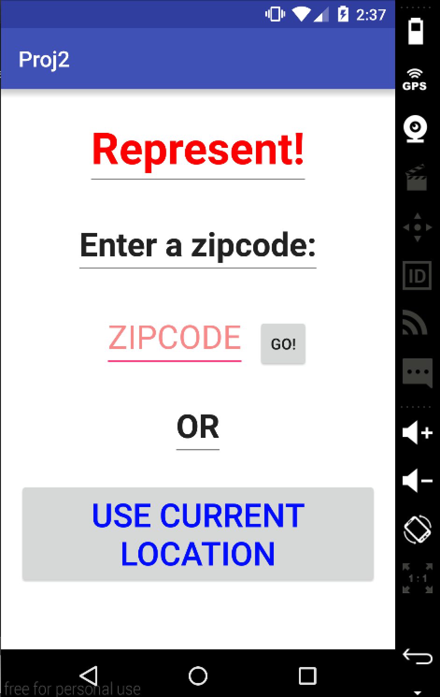
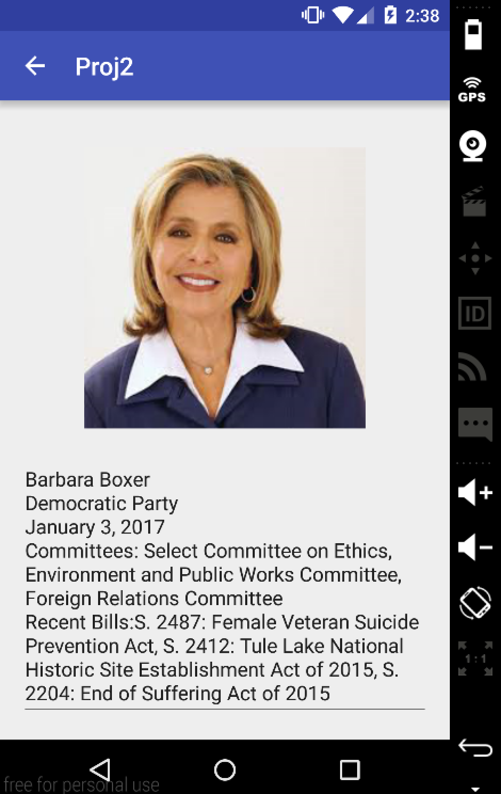

# PROG 02: Represent!

Represent!
	Shows users local Senators and House of Representative members. Shows the user detailed view on phone and compact view on watch. The user can pick locations by shaking watch, using current location, or by inputting a zipcode.

## Authors

Ellen Omoto ([ellen_omoto@berkeley.edu](mailto:ellen_omoto@berkeley.edu))

## Demo Video

See [Project 2B Demo] (https://youtu.be/9y8imwWxEXI)

## Screenshots

## Acknowledgments
Staff: From Catnip
http://jasonmcreynolds.com/?p=388: Acceleration

* Hat tip to anyone who's code was used
* Any other support
